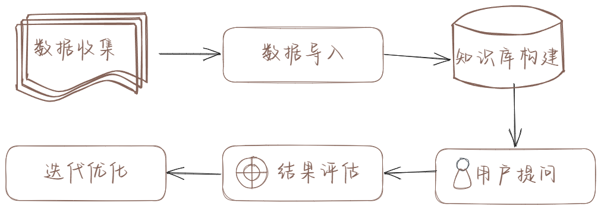
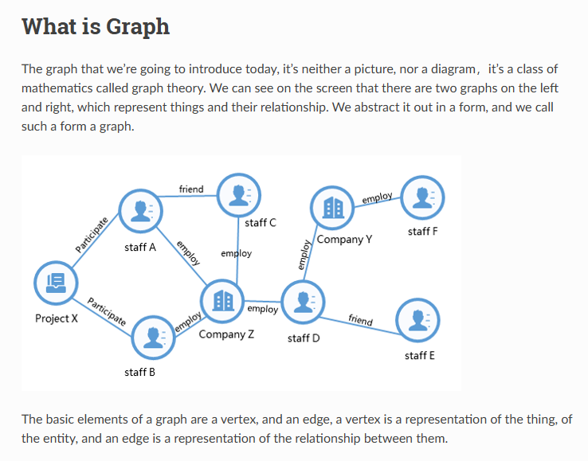

# RAG的道与术

# 讲什么，给谁看

本项目主要介绍RAG的坑和解决方法（并在最后附有各种解决方案的代码），包括数据处理、模型选择、构建流程、以及优化方法等，适合正在学习RAG或者进行RAG项目搭建的读者学习

# RAG基础概念（Retrieval-Augmented Generation）

RAG是一种能让大量知识 “活” 起来，人与知识无障碍对话的技术，从英文也可以看出，RAG就是通过用户的问题检索出相关知识给到AI进行回答的技术

# RAG背景

尽管AI大模型已经具备与用户流畅对话、解读知识和总结文章的能力，但它们的知识库主要来源于互联网上的公开内容。当我们需要AI处理企业内部文档、专有数据等非公开信息时，由于这些内容不在模型的训练范围内，就会出现知识盲区。RAG技术很好地解决了这个问题 - 它能让AI模型实时获取并理解我们提供的专有知识，从而针对特定领域或场景提供更加准确和相关的回答。

例如：当我们想要用AI查询公司的员工谁做过什么项目，通过互联网是查询不到的，但是通过RAG技术，我们可以将公司内部的知识库导入到AI中，然后AI就可以根据我们的问题检索出相关的知识进行回答

# RAG的主要应用场景

基于以上的介绍，RAG现今主要应用在企业知识库、客服机器人、产品自动推荐等场景，出名的产品有：

企微客服：通过导入公司的产品信息和客服服务规范，AI可以根据用户的问题回复相关的产品信息和一些简单的服务问题

产品推荐：通过用户的历史购买记录和当前描述的需求，AI可以检索产品库的相关产品，进而推荐出用户喜欢的产品

企业知识库：通过导入公司的文档、资料、项目信息等，AI可以检索出相关的信息进行回答，提高公司内容资料的查询

# RAG技术的核心步骤

RAG技术的核心步骤如上图所示，主要包括以下几个环节：

1. 收集数据：从各种来源收集相关的文本数据。
2. 数据处理：对收集到的数据进行清洗、分割等预处理。
3. 构建知识库：导入数据并配置AI回答规则
4. 用户提问：根据用户的问题，AI检索出相关的知识进行回答
5. 结果评估：根据用户的反馈，评估AI回答的准确性
6. 迭代优化：根据评估结果，优化知识库和AI回答规则
以下是根据您的要求生成的代码：

---

# RAG 七大坑

相信每个刚刚接触RAG的人都会觉得就是把内容丢进去向量库，然后用AI检索回答，就能觉得效果不错，再加上各种营销号分享AI+知识库有多强就容易觉得这很简单，但其实当我们在把大量的知识向量知识库输入并检验之后，就会发现真的有很多问题，为什么这个内容明明有但是就是检索不到？我的图片和表格数据都没办法导入怎么办？回答的语气好官方，废话很多？

如果你正在搭建一个RAG知识库，您肯定会多多少少遇到过以下这些问题：

1. 图片内容无法导入
2. 表格内容检索差
3. 提问总是检索不到对应的文本块
4. 对长文本提问总结性问题总是回答不全
5. 对于查询不到的问题进行编造强行回答
6. 查到的知识是对的，但是回答的语气，口吻和精细度不佳
7. 知识库特别大，难以完全测试来保证准确度

**要解决这些问题可以拆解为三个问题：**

1. **输入优-避免添加无效的，错误的内容，影响AI判断**
2. **查得准-对用户提出的问题可以检索到准确内容**
3. **表达好-AI对查询到的信息能够有准确的解读和转述**

以下为这三个优化方向的详细介绍，能够对解决7个问题

# RAG如何优化

## 输入优 

AI界有个很有名的话叫“Garbage in，Garbage out“-“巧妇难为无米之炊”

1. **内容精简，严谨**
    
    **精简：**首先我们要确认我们导入的资料是否是我们提问会问到的，如果不是，冗余的数据越多就会降低我们的检索准确度
    
    **准确：**对于内容中的描述，例如名词，动词，形容词有歧义或者矛盾的话，大模型后续判断是肯定会错误或者混乱的
    
    > 一个公文里面描述公司要招收211和985院校学生，另一个公文确说支持双非，当我们提问的双非是否可以进入公司，大模型就会判断错误了
    > 
    
2. **格式标准化**
    
    RAG技术主要是用embeding模型用用户的问题去搜索知识库，而知识库搜索主要只能靠文本进行搜索，如果我们不做任何处理，就会导致文档里面的图片和表格的信息丢失，进而降低了我们检索的准确度
    
    
    
    
    
    **图片：**通过多模态进行内容抽取，例如上面的图，用4o就可以理解用语言描述出主要是描述了人物和公司的关系图，凸显出graph的关系网功能，然后当我们搜索的时候就能够检索到
    
    **表格：**通过ocr抽取之后可以转化成markdown格式，或者用大模型转化成一句话的格式，例如xxx环境有什么目的，作用是什么，把一行数据转化成一句话
    
    现在如果有一个能够一站式将不同的文档转化成文本，目前在通用性和准确性较好的开源项目是[OmniParse](https://github.com/adithya-s-k/omniparse)
    
    **介绍：**
    
    这是一个将图片，表格，语音，视频等内容转化成文本的可视化工具，这可以展示抽取的效果，并进行优化修改
    
    
    
    **支持文件类型：**
    
    
    
    **参考效果：**
    
    
    
    但是这个部署需要一些时间，如果只想用代码实现类似效果，可以参考以下这位大佬的实现方法
    
    

### **学习代码：** [extend_adaptive_rag.ipynb](/data/xieyu/Teaching/RAG/rag_agent/extend_adaptive_rag.ipynb)    

## 查得准

首先大部分刚入门的AI的小白的直觉肯定是Embeding模型，或者Rerank模型选的好就能够查得准，但其实不然，除了以使用embeding，rerank为主的向量检索外，还有关键词检索（bm25，elasticsearch的keyword搜索），图检索（graphRAG，lightRAG）等方式

选择向量检索，还是关键词检索，图检索没有绝对的对错，而是应该按照具体的场景而定

| **检索方式** | **推荐场景** | **优点** | **缺点** |
| --- | --- | --- | --- |
| 向量检索 | 规章条文等上下文关联度不大的内容 | 速度快，能够语意检索 | 对于数字等关键词不敏感，且是通过内容切块导入，检索到的也是部分内容，需要总结概括的时候容易遗漏重要信息 |
| 图检索 | 小说，人物关系架构等复杂上下文内容 | 检索回来的内容一半是包括全文的相关内容，不受限于内容长度 | 构建内容的详细信息关系需要使用大模型（例如小说第一章讲小明，第二章小明的儿子，要构建出他们是父子关系的图就需要两章都给大模型，耗费很多token） |
| 关键词检索 | 有具体数字和数值等需要关键词识别的内容 | 精准 | 当我们不记得关键词的时候就无法查询 |

很多时候，我们查询的场景有可能需要同时使用这三种检索方式，可以参考我之前的这篇文章

1. 关键词检索
    1. 调用方法
2. 向量检索
    1. embeding模型
    2. rerank模型
    3. 向量库
    4. 参数配置
3. 图检索
    1. 调用方法

可以查看对应的代码查看如何使用这三类方法

### **学习代码：** [data_retriever.ipynb](/data/xieyu/Teaching/RAG/data_retriever/data_retriever.ipynb)   

## 表达好

当我们在给大模型提供了准确的信息后，他们会按照他们所想来回答，但是我们在使用RAG场景中经常会对回复的语气和表达有要求，举一个例子：

**默认风格回复**：

TuGraph 是一个高性能图数据库，支持大数据量、低延迟查找和快速图分析功能。它可以帮助你管理和分析复杂的关联数据，适用于金融、工业、政务服务等多个领域。

**配置搞笑可爱风格**：

TuGraph 是一个高效的图数据库，能够处理大数据量、低延迟查找和快速图分析。它支持多种API，适用于金融、工业、政务服务等多个领域，帮助用户管理和分析复杂关联数据。简单来说，它就像一个超级聪明的图书管理员，能快速找到你需要的书，还能帮你分析书中的内容！

## 高级用法

调整好数据的输入，选择好查询方式，配置好prompt已经可以满足大部分的需求，但是往往客户还有更多定制化的需求：

如何根据用户提问问题的类型来判断用知识库查询还是联网查询（例如：提问一下今天是什么日子？明天天气怎么样之类的来秀肌肉）

当提问的问题是知识库的范畴，但是缺少相关资料需要联网信息补充怎么办？

内容太过复杂，大模型总是胡乱编造应该如何避免？

### **学习代码：** [base_rag_agent.ipynb](/data/xieyu/Teaching/RAG/rag_agent/base_rag_agent.ipynb)  

# 待更新

- [ ]  JinaAI embeding模型的用法
- [ ]  Embeding模型微调方法
- [ ]  RAG自动评估